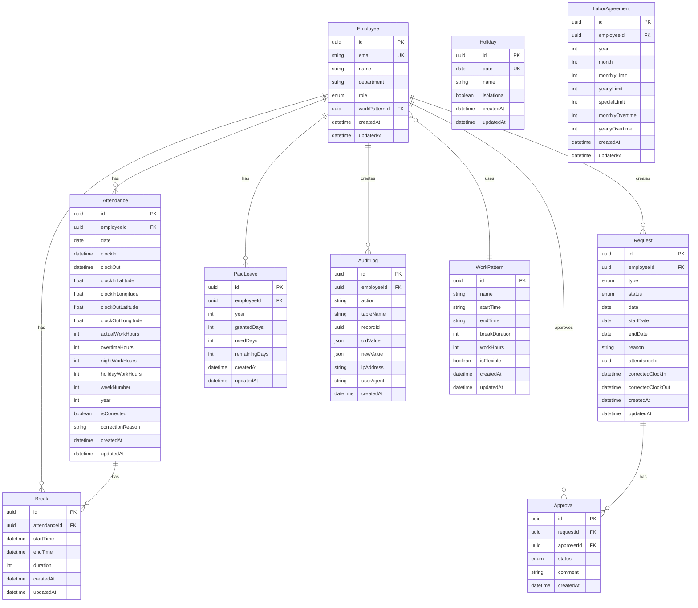

# データベース ER 図

出退勤管理システムのデータベース設計図

## ER 図（Mermaid 形式）

## テーブル一覧

### 1. Employee (従業員マスタ)

- 従業員の基本情報を管理
- 役割（employee, manager, admin）を設定
- 勤務パターンと紐付け

### 2. WorkPattern (勤務パターン)

- 始業・終業時刻、休憩時間を定義
- 複数の従業員が同じパターンを使用可能

### 3. Attendance (勤怠記録)

- 日次の出退勤記録
- GPS 位置情報を保存（出勤・退勤それぞれ）
- 労働時間の自動計算結果を保存
- 修正履歴を記録

### 4. Break (休憩記録)

- 1 日の勤怠記録に複数の休憩を記録可能
- 休憩時間の累計を管理

### 5. Request (申請データ)

- 打刻修正申請、休暇申請を管理
- 承認ステータスを管理

### 6. Approval (承認履歴)

- 申請の承認・却下履歴
- 承認者とコメントを記録

### 7. PaidLeave (年次有給休暇)

- 年度ごとの有給休暇管理
- 付与日数、使用日数、残日数を管理

### 8. AuditLog (操作ログ)

- 全ての重要な操作を記録
- 改ざん防止・監査用

### 9. Holiday (法定休日)

- 国民の祝日を管理
- 休日労働時間の計算に使用

### 10. LaborAgreement (36 協定管理)

- フェーズ 2 で実装予定
- 時間外労働の上限管理

## リレーション概要

1. **Employee → Attendance**: 1 対多（1 人の従業員は複数の勤怠記録を持つ）
2. **Employee → Request**: 1 対多（1 人の従業員は複数の申請を作成）
3. **Employee → Approval**: 1 対多（1 人の管理者は複数の申請を承認）
4. **Attendance → Break**: 1 対多（1 日の勤怠に複数の休憩）
5. **Request → Approval**: 1 対多（1 つの申請に複数の承認履歴）
6. **Employee → WorkPattern**: 多対 1（複数の従業員が同じ勤務パターンを使用）

## インデックス戦略

- **Employee**: email（ユニーク）、department（検索用）
- **Attendance**: employeeId + date（ユニーク）、date（日付検索）、employeeId + year + weekNumber（週次集計）
- **Request**: employeeId、status、type（フィルター用）
- **AuditLog**: tableName + recordId、createdAt（時系列検索）

## データ保持期間

- 勤怠データ: 5 年間（法令遵守）
- 従業員マスタ: 退職後 3 年間
- 申請データ: 3 年間
- 操作ログ: 1 年間
